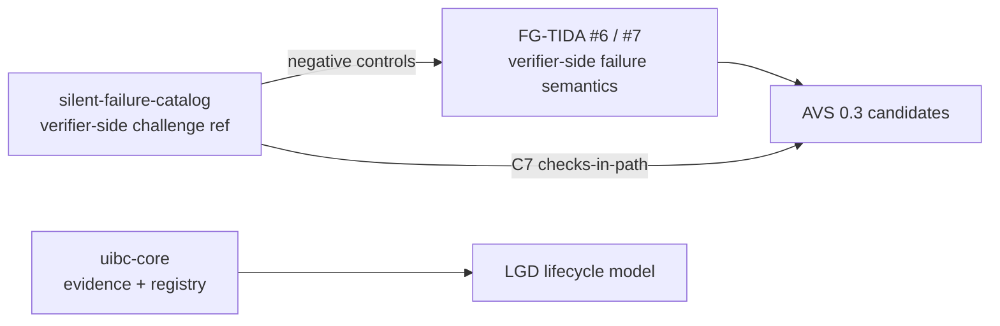

# Steven Zhao · China

> Profile README · 全景入口与权属宣告 · Public site: <https://medxpert.cn>

## Fixed vocabulary · 固定词汇表

Four names, four layers — used consistently across all repositories:

| Term | Layer | What it is |
|---|---|---|
| **XLGD** | Umbrella · 伞 | The umbrella identifier for the theory-and-protocol line. **X is a distinction mark** used for attribution; it covers the theory and protocol layers below. |
| **LGD** | Theory · 理论 | 凡自治之物：**有籍（registered）· 有证（evidenced）· 有门禁（gated）**，由生到退全程可溯、可证、可问责。 |
| **UIBC** | Protocol · 协议 | The **executable** protocol: registry / evidence / gates, with a reference implementation and a benchmark. |
| **MedXpert** | Applications · 应用 | The medical-device compliance product line — **parallel to, not inside, the XLGD umbrella**. |

All four are project identifiers only — **no entity or trademark registration filed**.

## The stack · 三层结构

| Layer | Repos | One line |
|---|---|---|
| **Theory** | [lgd-theory](https://github.com/zhaoxinghua09-cell/lgd-theory) · [xlgd](https://github.com/zhaoxinghua09-cell/xlgd) · [xcgs-manifesto](https://github.com/zhaoxinghua09-cell/xcgs-manifesto) | Machine-checkable lifecycle model: registry · evidence · gates. |
| **Protocol** | [uibc-core](https://github.com/zhaoxinghua09-cell/uibc-core) · [uibc-competition](https://github.com/zhaoxinghua09-cell/uibc-competition) · [silent-failure-catalog](https://github.com/zhaoxinghua09-cell/silent-failure-catalog) · [assayance](https://github.com/zhaoxinghua09-cell/assayance) | Executable evidence/registry/validator core, the UIBC-MEM benchmark, and the verifier-side silent-failure challenge reference. |
| **Applications** | [medxpert-reg-kb](https://github.com/zhaoxinghua09-cell/medxpert-reg-kb) · [medxpert-reg-connector](https://github.com/zhaoxinghua09-cell/medxpert-reg-connector) · [medxpert-skills](https://github.com/zhaoxinghua09-cell/medxpert-skills) · [agent-skills](https://github.com/zhaoxinghua09-cell/agent-skills) · [agent-memory-service](https://github.com/zhaoxinghua09-cell/agent-memory-service) · [lgd-hub](https://github.com/zhaoxinghua09-cell/lgd-hub) | Product integrations: medical-device compliance tooling, agent skill packs, memory service, unified entry hub. |

## What I build

I build **machine-checkable** verifier-side primitives — validation that fails visibly instead of passing silently. Work submitted to **ITU FG-TIDA** (themes **#6** *Verifier-side requirements and failure semantics* and **#7**) includes:

- **[silent-failure-catalog](https://github.com/zhaoxinghua09-cell/silent-failure-catalog)** — a named catalog of **14 silent-failure modes** (validation that passes while nothing is checked), each with a runnable reproduction, a fix, and a **negative control**. Submitted to FG-TIDA as a verifier-side challenge reference (**PR [#23](https://github.com/FG-TIDA/use-cases/pull/23)** in `FG-TIDA/use-cases`); cited in themes #6/#7.
- **[uibc-core](https://github.com/zhaoxinghua09-cell/uibc-core)** — evidence / registry / validator core for bounded-lifecycle systems (Apache-2.0).
- **[lgd-theory](https://github.com/zhaoxinghua09-cell/lgd-theory)** — a machine-checkable lifecycle model (registry · evidence · gates).

### How the pieces connect / 流转关系

## Repositories by track / 按主线

| Track | Representative repos |
|---|---|
| LGD theory | `lgd-theory`, `lgd-hub`, `xlgd`, `xcgs-manifesto` |
| UIBC autonomous things | `uibc-core`, `uibc-competition` |
| Verifier-side / silent failure | `silent-failure-catalog`, `assayance` |
| MedXpert medical-device compliance | `medxpert-reg-kb`, `medxpert-reg-connector`, `medxpert-skills` |
| Agents & memory | `agent-skills`, `agent-memory-service` |

## Rights notice · 权利宣告

All account content is **All Rights Reserved** (text, methodology, theory terms, specs, examples, scripts). Code is released under MIT / Apache-2.0 / AGPL-3.0 per repo. Attribution-only citation is permitted with named source + link + rights holder *Zhao Xinghua / Steven Zhao·China*.

**Brand status:** MedXpert, SynomosAI, LGD, UIBC, Nomos, XLGD are project identifiers only — **no entity or trademark registration filed**. Their appearance is source identification, not a claim of legal-entity or trademark rights.

## Contact · 联系

- Email: zhaoxinghua09@gmail.com
- ORCID: 0009-0001-0512-1237
- Site: <https://medxpert.cn>

---

*Maintained by the rights holder. Public information only; not legal, regulatory, or registration advice.*

---

# 中文说明

本账号聚焦于**可机器核验的验证方构件**——让校验在失效时可见，而不是静默通过。已提交 **ITU FG-TIDA**（主题 **#6** 验证方失败语义、**#7**）的工作包括：

- **[silent-failure-catalog](https://github.com/zhaoxinghua09-cell/silent-failure-catalog)** —— 14 种"静默失败"模式的命名目录，每条含可运行复现、修法、反向对照。已作为验证方挑战参考实现提交（`FG-TIDA/use-cases` **PR [#23](https://github.com/FG-TIDA/use-cases/pull/23)**），并在 #6/#7 被引用。
- **[uibc-core](https://github.com/zhaoxinghua09-cell/uibc-core)** —— 有界生命周期系统的证据/注册/验证内核（Apache-2.0）。
- **[lgd-theory](https://github.com/zhaoxinghua09-cell/lgd-theory)** —— 机器可核验的全生命周期模型（注册·证据·门禁）。

### 固定词汇表

| 术语 | 层 | 含义 |
|---|---|---|
| **XLGD** | 伞 | 理论与协议线伞层标识；X 是区别符，用于标明来源 |
| **LGD** | 理论 | 全生命周期模型：凡自治之物，有籍·有证·有门禁 |
| **UIBC** | 协议 | 可执行协议：registry / evidence / gates 参考实现 + 基准 |
| **MedXpert** | 应用 | 医疗器械合规产品线——**与 XLGD 伞并行，不在伞内** |

### 三层结构

**理论层**（lgd-theory · xlgd · xcgs-manifesto）→ **协议层**（uibc-core · uibc-competition · silent-failure-catalog · assayance）→ **应用层**（medxpert 系列 · agent-skills · agent-memory-service · lgd-hub）。

**权利宣告**：本账号全部内容保留所有权利；代码依各仓许可证（MIT/Apache-2.0/AGPL-3.0）使用。署名引用须标注权利人「赵兴华 / Steven Zhao·China」。MedXpert、SynomosAI、LGD、UIBC、XLGD 等仅为项目标识，**均未申请实体/商标注册**。
